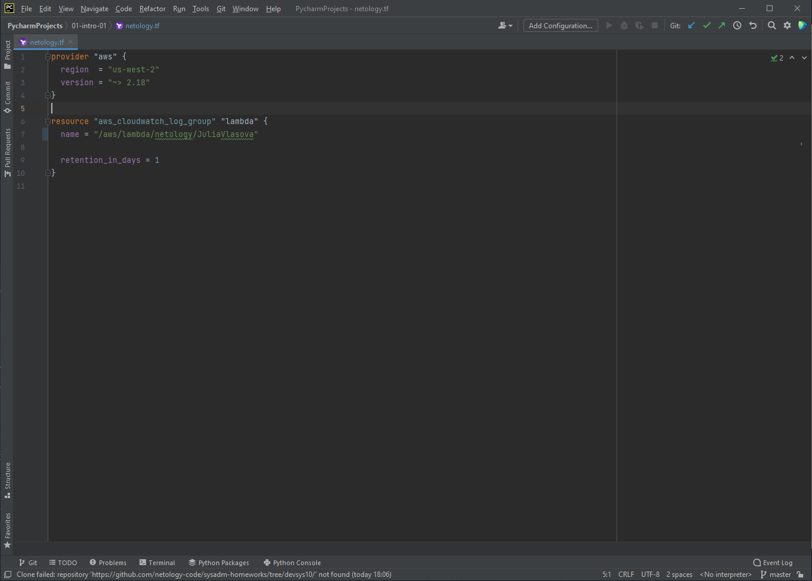
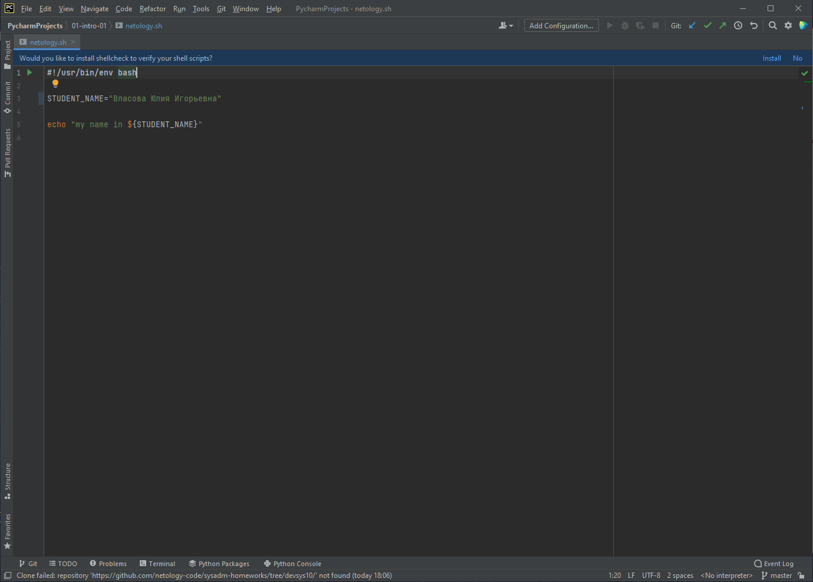
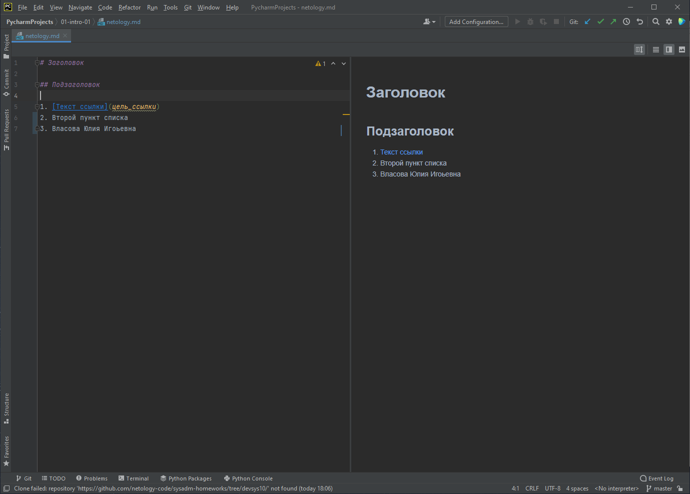
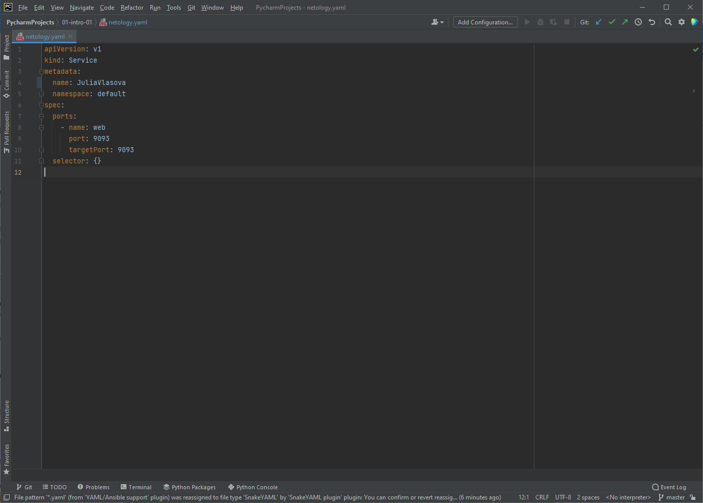
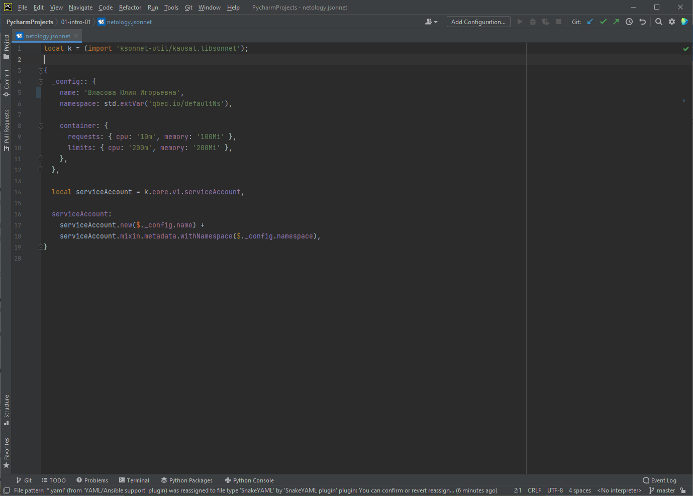

# Домашнее задание к занятию «1.1. Введение в DevOps»

## Задание №1 - Подготовка рабочей среды

- **Terraform**: 

- **Bash**: 

- **Markdown**: 

- **Yaml**: 

- **Jsonnet**: 

## Задание №2 - Описание жизненного цикла задачи (разработки нового функционала)

1. Выяснить чего хочет клиент. Менеджер (возможно при участии разроботчика) выясняет хотелки клиента.
2. 
 * Разработчики и DevOps-инженер решают в какой среде будет разрабатываться ПО и какое оборудование необходимо для этого. 
4.2. Настраивается среда для разработки.
5.1. Непосредственно разработка приложения.
6.2. Настраивается среда для тестирования.
7.1. Тестирование вносимых изменений. Если не прошли тесты, то ПО отправляется на доработку.
8.2. Настравиается песочница.
9. Показ разработанного ПО в песочнице с начала менеджеру, потом клиенту. Если не понравилось, то между клиентом, менеджером и разработачикам обсуждаются новые параметры и ПО уходит на доработку.
10. Выкладка в продакшн.
11. Не забываем про мониторинг на всех этапах с момента начала разработки.
