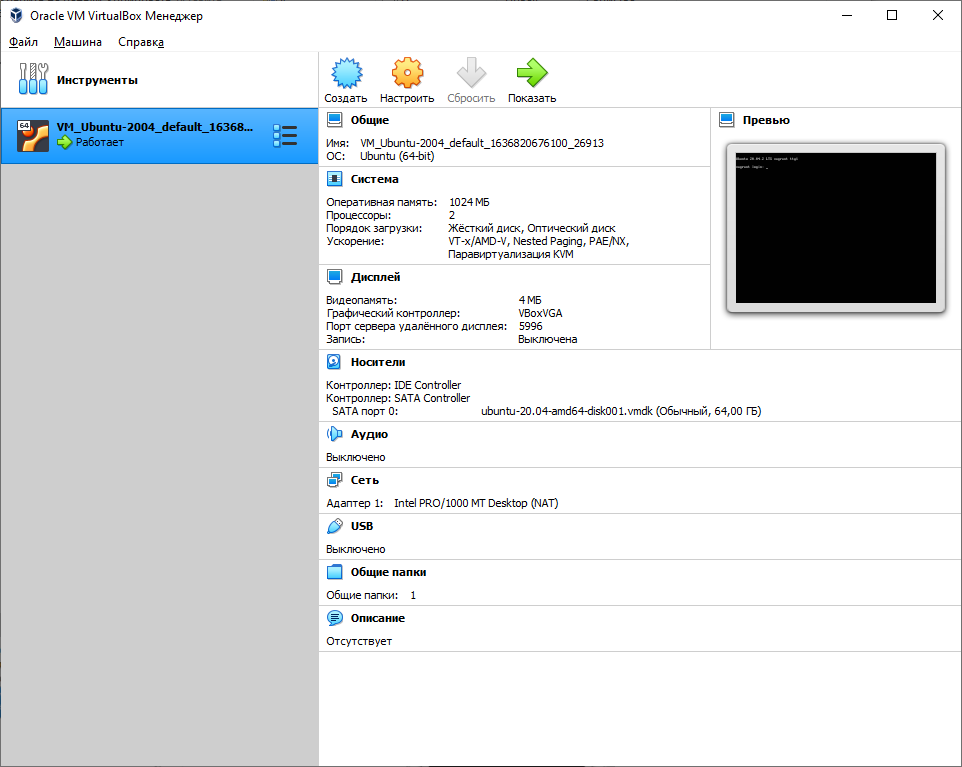
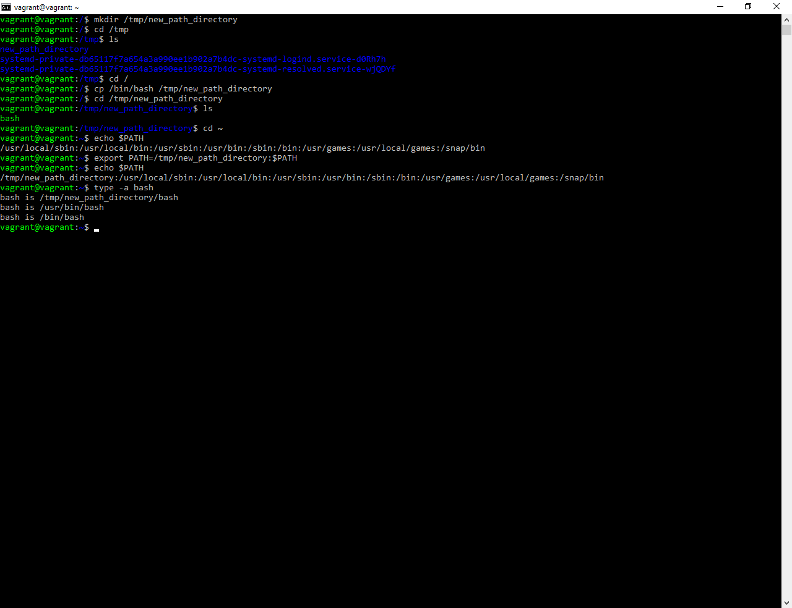

# Домашнее задание к занятию "3.1. Работа в терминале, лекция 1"  
### 1-4  
Установила **Oracle VirtualBox** и **Vagrant**. С помощью базового файла конфигурации запустила Ubuntu 20.04 в VirtualBox посредством Vagrant: и выполнила все команды из здания 4. В процессе установки и развертывания возникли проблемы Kaspersky, который мешал скачиванию образа ОС – добавила Vagrant в исключения. Так же пришлось добавить системную переменную VAGRANT_HOME и уазать ей папку, т.к. у меня профиль пользователя ОС на кириллице. 

### 5  
По умолчанию выделено:   
Оперативной памяти - 1024 МБ  
Процессоров – 2  
Жесткий диск – динамический 64 ГБ  
 

 
### 6  
Надо добавить внутрь **Vagrantfile** конструкцию

    config.vm.provider "virtualbox" do |v|
        v.memory = 2048
        v.cpus = 2
**v.memory** – количество выделяемой оперативной памяти  
**v.cpus** – количество выделяемых ресурсов процессора

### 8   
- длину журнала **history** можно задать переменной **HISTSIZE**, работа этой переменной описывается начиная со строки 729 (для моего размера экрана) man bash
- **ignoreboth** задается как значение переменной **HISTCONTROL** и не записывает в историю команды, которые начинаются с пробела, либо дублируют предыдущие команды (строка 709 man bash).  
### 9  
`{}` указывают диапазон значений, аргументов. Найдено в строке 922 раздел **BRACE EXPANSION**  
### 10  
Для того чтобы создать одним вызовом 100тыс. файлов используем команду: 

        touch {1..100000}    
Создать за один раз 300тыс. файлов не получится, т.к. упремся в длину одного аргумента.   

*Самый сложный пункт для меня. Нашла несколько возможных ответов как найти предел длины аргумента.*  

Есть вариант проверить фактические текущие ограничения ОС выполнить команду:  

    xargs --show-limits
Получим вывод:  

    Your environment variables take up 2153 bytes
    POSIX upper limit on argument length (this system): 2092951
    POSIX smallest allowable upper limit on argument length (all systems): 4096
    Maximum length of command we could actually use: 2090798
    Size of command buffer we are actually using: 131072
    Maximum parallelism (--max-procs must be no greater): 2147483647
Где нас интересует: `Size of command buffer we are actually using: 131072`  

И второй вариант:  
Максимальная длина аргумента не должна превышать константу **MAX_ARG_STRLEN**, а она в свою очередь равна **PAGE_SIZE** * 32, выполним:

    getconf PAGE_SIZE
    4096
Значит **MAX_ARG_STRLEN** равен 4096*32 = 131072

### 11    
Конструкция `[[ -d /tmp ]]` проверяет существует ли каталог **tmp**. Найдено в разделе **CONDITIONAL EXPRESSION** man bash.

### 12  

### 13  
`at` позволяет планировать выполнение команд в указанное время, команды заданные этой утилитой выполняются один раз.  
`batch` выполняет команды, когда позволяют уровни загрузки системы; другими словами, когда среднее значение нагрузки падает ниже 1,5 или значения, указанного в вызове atd

