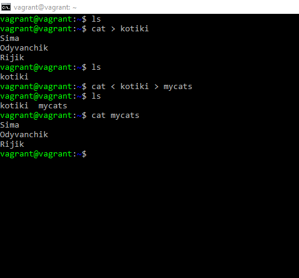
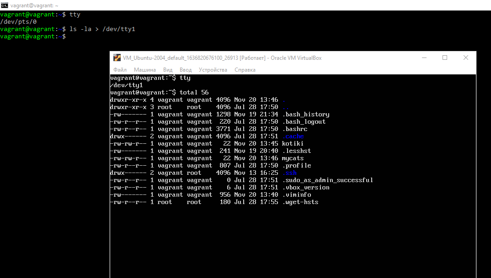
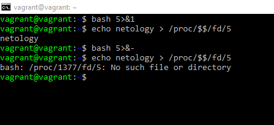
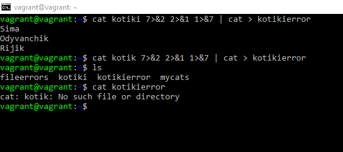
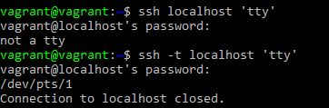

# Домашнее задание к занятию "3.2. Работа в терминале, лекция 2"

### 1  
Команда **cd** – встроенная в оболочку команда. На мой взгляд она не может быть другого типа именно по причине выполняемой ею функции – смены каталога, ибо без нее мы даже банально не сможет перейти в каталог чтобы установить нужную из него программу/команду.

    Type cd  
    cd is a shell builtin  

### 2  
Альтернативой команде:  

    grep <some_string> <some_file> | wc -l  
является команда:   

    grep <some_string> <some_file> -с  
Ключ `-c` для команды grep помогает подсчитать количество совпадающих строк.

### 3  
Процесс **Init** - это родительский процесс для всех процессов в системе, это первая программа, которая исполняется при загрузке системы Linux; он управляет всеми другими процессами в системе. **Init** запускается непосредственно ядром системы, поэтому он в принципе не имеет родительского процесса. Процесс **Init** всегда получает **ID 1**. Он функционирует как приемный родитель для всех осиротевших процессов.  
Выполним:  
   
    ps -p 1  
    PID TTY          TIME CMD
    1   ?        00:00:02 systemd
Процесс с **PID 1** носит имя – `systemd`  

### 4  
Команда перенаправления ошибки stderr для ls будет выглядеть так:  

	ls <options> 2> /dev/tty1
где **options** - ключи для команды **ls**  
**/dev/tty1** – терминал, в который мы хотим перенаправить ошибку  
Команду отправляем из виртуального терминала **/dev/pts/0** 

### 5  

### 6  
Вывести данные из **PTY** в **TTY** можно используя перенаправление **>**  
Увидеть данные получится если переключиться из **PTY** из которого отправляешь, в **TTY** в который отправляешь.  

Отправим вывод команды `ls -la` из `/dev/pts/0` в `/dev/tty1`  

### 7  
Конструкция bash `5>&1` создает дескриптор `5` и перенаправляет его в `stdout`.   
В директории **/proc** хранится информация о процессах, **$$** - текущий процесс, **/proc/$$/fd/** содержит информацию о файловых дескрипторах. Поэтому, конструкция `echo netology > /proc/$$/fd/5` перенаправит отображение слова `netology` в вывод дескриптора `5`. Далее можем закрыть дескриптор `5`  командой `bash 5>&-`

### 8  

Соберем конструкцию, которая в случае успеха будет выводить на экран содержимое файла **kotiki**, а в случае ошибки в имени файла, создаст и запишет текст ошибки в файл **kotikierror**. Для этого понадобится создать дескриптор **7** и перенаправить его в **stderr** `7>&2`, далее **stderr** перенаправить в **stdout** `2>&1`, **stdout** перенаправить в новый дескриптор `1>&7`.  

### 9  
Команда `cat /proc/$$/environ` показывает переменные окружения доступные для текущего процесса. Аналогичную информацию выведут команды `printenv` и `env`.  

### 10  
**/proc/<PID>/cmdline** - содержит полную командную строку, которой был запущен процесс, если только процесс не является зомби  

**/proc/<PID>/exe** – представляет собой символическую ссылку, содержащую фактический путь к выполняемой команде  

### 11  
Выполним команду:

	cat /proc/cpuinfo

В выводе найдем необходимую нам информацию про SSE. **SSE 4.2** максимальная доступная версия.

### 12  
В `man ssh` нашелся флаг `-t` – принудительное выделение псевдо-терминала, который позволил выполнить команду.  

### 13  
Находясь в первом терминале выполним:   

    sudo apt install reptyr

    screen

    ps aux | grep screen
    vagrant     2282  0.0  0.1   9420  3072 pts/0    S+   20:33   0:00 screen

Переходим во второй терминал, куда мы хотим перенести процесс screen. Выполняем:

	reptyr 2282
В выводе получим ошибку об отсутствии у нас прав. Выполняем:

	sudo -i
	echo 0 > /proc/sys/kernel/yama/ptrace_scope
Повторно выполняем:  

    reptyr 2282
В выводе первого терминала появляется:  

    [1]+  Stopped                 screen

Проверим что сменился терминал:  

    ps aux | grep screen
    vagrant     2282  0.0  0.1   9420  3152 pts/2    Ss+  20:33   0:00 screen
 
### 14  
Команда `tee` читает из стандартного потока ввода и записывает в стандартный поток вывода и в файл одновременно.  
В первом варианте сессия запущена с правами обычного пользователя, и мы с этим правами пытались писать в папку `/root` на которую у нас просто нет прав.  
Во втором случае мы tee запускаем через sudo, чем повышаем ей привилегии и что позволит ей записать данные в папку `/root`.

