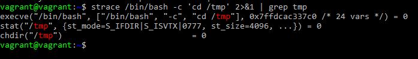

# Домашнее задание к занятию "3.3. Операционные системы, лекция 1"

### 1  
Выполним:  

	strace /bin/bash -c 'cd /tmp' 2>&1 | grep tmp

Ответ: `chdir("/tmp") = 0`  

### 2  
В `man file` описано, что `file` использует «магические» тесты для определения типа формата. Магические файлы для соответствующих тестов находятся в папках **/usr/local/share/misc/magic.mgc,  /usr/local/share/misc/magic,  $HOME/.magic.mgc,  $HOME/.magic**.
Выполним:

	strace file kotiki 2>&1 | grep magic
  
В данном случае базы по которым происходит поиск видны в выводе:

    openat(AT_FDCWD, "/etc/magic", O_RDONLY) = 3  
    openat(AT_FDCWD, "/usr/share/misc/magic.mgc", O_RDONLY) = 3

### 3  
Выполним:  

	lsof | grep deleted
В выводе будет фигурировать процесс, ссылающийся на удаленный файл. Там же мы сможем узнать PID процесса и номер дескриптора. Они нам понадобятся для того, чтобы направить в дескриптор вывод из **/dev/null** тем самым обнулив его. Выполним:

	cat /dev/null > /proc/PID/fd/FD
где PID - PID нашего процесса, FD - дескриптор нашего процесса

### 4  
Зомби-процессы не занимают не каких ресурсов, т.к. это процессы, которые по факту уже отработали, но по какой-то причине родительский процесс не обработал код возврата, поэтому он стал зомбиком. Единственное «но» зомбики занимают место в таблице процессов, а она ограничена.

### 5  
Для установки пакета BCC выполним:

	sudo apt-get install bpfcc-tools linux-headers-$(uname -r)
Согласно `man opensnoop` – данная утилита отслеживает системные вызовы **open ()**, показывая какие процессы пытаются открыть какие файлы и возвращает номер дескриптора.  
В нашем случае дополнительно задействуем ключ `-d` - общая продолжительность трассировки в секундах. Выполним:

	sudo opensnoop-bpfcc -d 1
Получим в выводе искомые вызовы:  

	PID    COMM               FD ERR PATH
    1      systemd            12   0 /proc/405/cgroup
    824    vminfo              4   0 /var/run/utmp

### 6  
Для просмотра системных вызовов `uname -a` выполним:  

	strace uname -a

    uname({sysname="Linux", nodename="vagrant", ...}) = 0
    fstat(1, {st_mode=S_IFCHR|0600, st_rdev=makedev(0x88, 0), ...}) = 0
    uname({sysname="Linux", nodename="vagrant", ...}) = 0
    uname({sysname="Linux", nodename="vagrant", ...}) = 0
    write(1, "Linux vagrant 5.4.0-80-generic #"..., 105Linux vagrant 5.4.0-80-generic #90-Ubuntu SMP Fri Jul 9 22:49:44 UTC 2021 x86_64 x86_64 x86_64 GNU/Linux) = 105  

Выходит, что `uname -a` использует системный вызов `uname`.
Первичный поиск **/proc** по `man uname` не дал результатов. Поразбиравшись выяснила, что есть вторая часть мануала, которую нужно дополнительно скачивать и устанавливать. Выполним:  

	sudo apt install manpages-dev
Теперь поиск **/proc** дает результат:  
`Part of the utsname information is also accessible via /proc/sys/kernel/{ostype, hostname, osrelease, version, domainname}`

### 7  
**&&** - позволяет выполнять следующую команду, только если предыдущая завершилась с кодом 0, то есть успешно, в противном случае следующая команда не выполняется.  
**;** - последовательное выполнение команд в любом случае, вне зависимости от конечного результата предыдущей команды.

    root@netology1:~# test -d /tmp/some_dir; echo Hi
    Hi
В данном случае вывод `Hi` сработал, т.к. стояла **;** и следующая команда отработала не смотря на то что каталога `/tmp/some_dir` не существует/

    root@netology1:~# test -d /tmp/some_dir && echo Hi
    root@netology1:~#
А вот тут не произошло ничего т.к. каталога `/tmp/some_dir` и код завершения команды отличен от **0** и **&&** не позволили выполнять следующую команду.  
`set -e` подразумевает выход из скрипта при выполнении любой команды с не 0-м кодом возврата, поэтому использовать его в сочетании с **&&** смысла нет, поскольку **&&** по сути дублируют функцию `set -e`

### 8  
` set -euxo pipefail` 

`-e` - прекращает выполнение скрипта если команда завершилась ошибкой.    
`-u` - прекращает выполнение скрипта, если встретилась несуществующая переменная.    
`-x` - выводит выполняемые команды в stdout перед выполнением.     
`-o` добавляет доп. опцию, в данном случае `pipefail`.  
`pipefail` - возвращает значение команды, которая завершилась с ошибкой, либо 0, если все отработало корректно.  
Такая конструкция позволяет вовремя остановить выполнение некорректного сценария. Своего рода дополнительная защита.  

### 9  
Выполним:  

    ps -o stat

    STAT
    Ss
    R+
`S` - прерывистый сон (ожидание завершения события), `s` - является лидером сеанса, первый процесс в сессии  
`R` - работает или может быть запущен (в очереди выполнения), `+` - находится в группе процессов запущенных на переднем плане (не в фоновом режиме)

